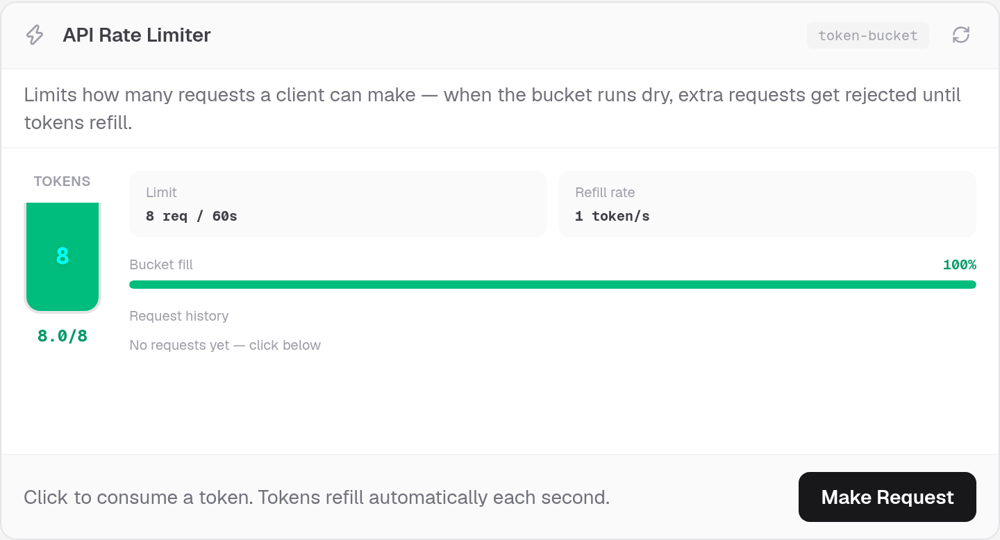
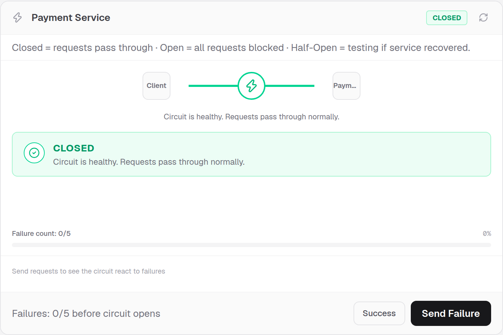
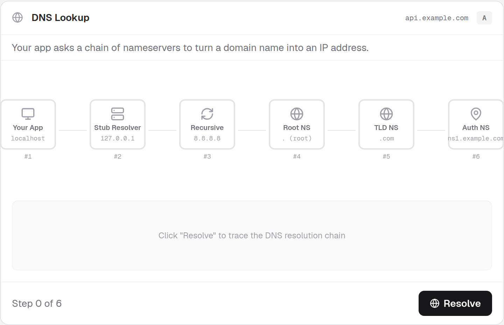
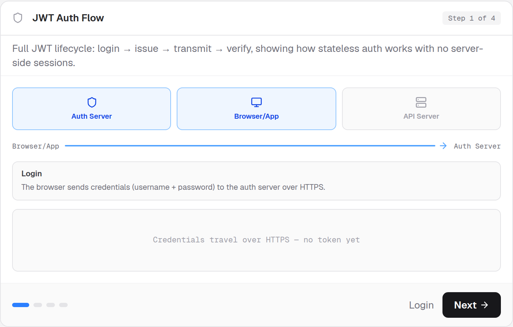
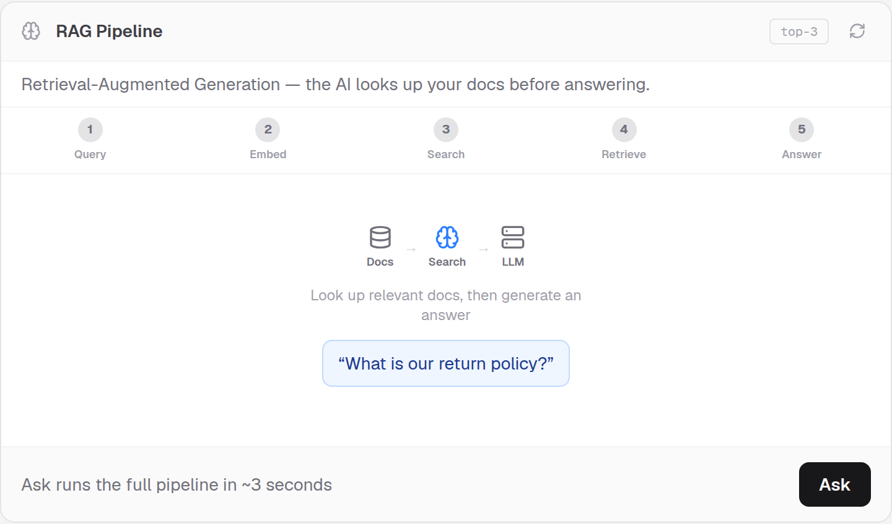

# TechUI

**Interactive React components that make software engineering concepts visually obvious.**

Add rate limiters, circuit breakers, DNS lookups, JWT flows, RAG pipelines, and **180+ more** to any Next.js or React project — the same way you add [shadcn/ui](https://ui.shadcn.com) components.

[](https://techui.vercel.app/playground)
[](./LICENSE)

---

## Why TechUI?

Most engineering concepts are explained with walls of text. TechUI gives you **ready-made, interactive cards** — each one a self-contained lesson with animations, live controls, and plain-English descriptions. Drop them into docs, courses, blog posts, or internal tools.

**Live demo:** [techui.vercel.app/playground](https://techui.vercel.app/playground)

---

## Quick start

```bash
# 1. Initialize TechUI in your project
npx @aqib_nawab/techui init

# 2. Add the cn() utility (required by most components)
npx @aqib_nawab/techui add utils

# 3. Add any component by name
npx @aqib_nawab/techui add rate-limiter
npx @aqib_nawab/techui add circuit-breaker dns-lookup jwt-flow
```

Then import and use:

```tsx
import { RateLimiter } from "@/components/techui/api/RateLimiter";

export default function Page() {
  return (
    <RateLimiter
      name="API Rate Limiter"
      limit={8}
      windowSeconds={60}
      refillRate={1}
    />
  );
}
```

---

## Component showcase

Each component is a polished, interactive card with a fixed layout: header → description → visual → footer action.

### Rate Limiter

Token-bucket animation — watch tokens refill and requests get rejected when the bucket is empty.



```bash
npx @aqib_nawab/techui add rate-limiter
```

---

### Circuit Breaker

Closed / Open / Half-Open states with a live request simulator.



```bash
npx @aqib_nawab/techui add circuit-breaker
```

---

### DNS Lookup

Hop-chain diagram showing stub → recursive → root → TLD → authoritative resolution.



```bash
npx @aqib_nawab/techui add dns-lookup
```

---

### JWT Auth Flow

Full stateless auth lifecycle: login → issue → transmit → verify.



```bash
npx @aqib_nawab/techui add jwt-flow
```

---

### RAG Pipeline

Retrieval-Augmented Generation — query → embed → vector search → LLM → answer.



```bash
npx @aqib_nawab/techui add ai-rag
```

---

## Commands

| Command | Description |
|---------|-------------|
| `npx @aqib_nawab/techui init` | Create `techui.json` in your project root |
| `npx @aqib_nawab/techui add <name>` | Copy one or more components into your project |
| `npx @aqib_nawab/techui add <name> --overwrite` | Replace existing files |
| `npx @aqib_nawab/techui list` | List all available components |
| `npx @aqib_nawab/techui list --category api` | Filter by category |

Install globally to use the shorter `techui` command:

```bash
npm i -g @aqib_nawab/techui
techui init
techui add rate-limiter
```

---

## Configuration

Running `init` creates `techui.json`:

```json
{
  "$schema": "https://techui.dev/schema/techui.json",
  "style": "default",
  "rsc": true,
  "tsx": true,
  "tailwind": {
    "config": "",
    "css": "src/app/globals.css",
    "baseColor": "zinc",
    "cssVariables": true
  },
  "aliases": {
    "components": "@/components/techui",
    "utils": "@/lib/utils"
  },
  "registry": "https://techui.vercel.app/r"
}
```

| Field | Purpose |
|-------|---------|
| `aliases.components` | Where component files are copied |
| `aliases.utils` | Path to your `cn()` helper |
| `registry` | URL of the component registry (auto-updated on deploy) |

Components install to:

```
src/components/techui/
├── api/
│   └── RateLimiter.tsx
├── distributed/
│   └── CircuitBreaker.tsx
└── ...
```

---

## Requirements

TechUI components need these peer dependencies (same stack as shadcn/ui):

```bash
npm install react react-dom zod lucide-react clsx tailwind-merge
npm install -D tailwindcss
```

Each component also uses Tailwind CSS utility classes. Your project should already have Tailwind configured (Next.js + shadcn setup works out of the box).

**Always add `utils` first** if you don't already have a `cn()` helper:

```bash
npx @aqib_nawab/techui add utils
```

---

## Browse all components

```bash
npx @aqib_nawab/techui list
```

**Categories:** API · Architecture · Database · Auth · Networking · Cloud · Containers · Distributed · Code · DevTools · UI · AI · Education

Or explore interactively: [techui.vercel.app/playground](https://techui.vercel.app/playground)

---

## How it works

TechUI follows the [shadcn registry pattern](https://ui.shadcn.com/docs/registry):

1. **Registry** — JSON files hosted at `https://techui.vercel.app/r/` with full component source
2. **CLI** — Fetches registry entries and copies files into your project
3. **You own the code** — Components live in your repo, fully editable

When new components are added to TechUI, you get them automatically — no CLI update needed.

---

## For AI agents & IDEs

TechUI includes an agent skill for Cursor and compatible tools. See the main repo:

- **Skill:** [skills/techui/SKILL.md](https://github.com/AQIB-NAWAB/TechUI/blob/main/skills/techui/SKILL.md)
- **Design spec:** [docs/COMPONENT_SPEC.md](https://github.com/AQIB-NAWAB/TechUI/blob/main/docs/COMPONENT_SPEC.md)

---

## Links

| | |
|---|---|
| **Playground** | [techui.vercel.app/playground](https://techui.vercel.app/playground) |
| **GitHub** | [github.com/AQIB-NAWAB/TechUI](https://github.com/AQIB-NAWAB/TechUI) |
| **Registry** | [techui.vercel.app/r/index.json](https://techui.vercel.app/r/index.json) |
| **Issues** | [github.com/AQIB-NAWAB/TechUI/issues](https://github.com/AQIB-NAWAB/TechUI/issues) |

---

## License

MIT © [AQIB NAWAB](https://github.com/AQIB-NAWAB)
